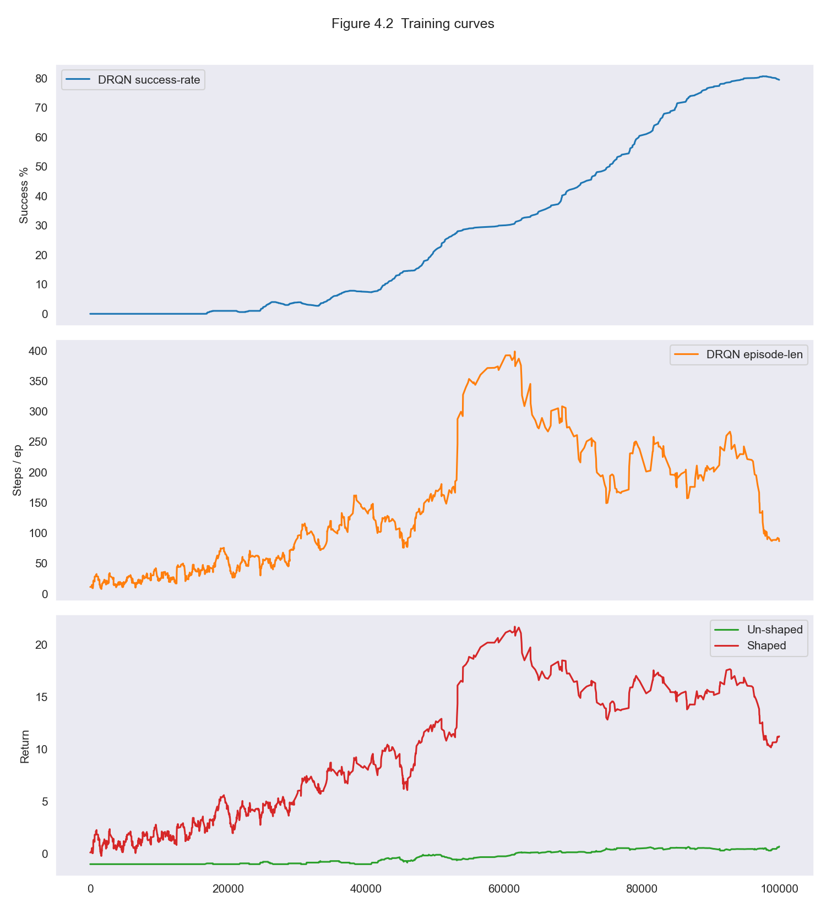
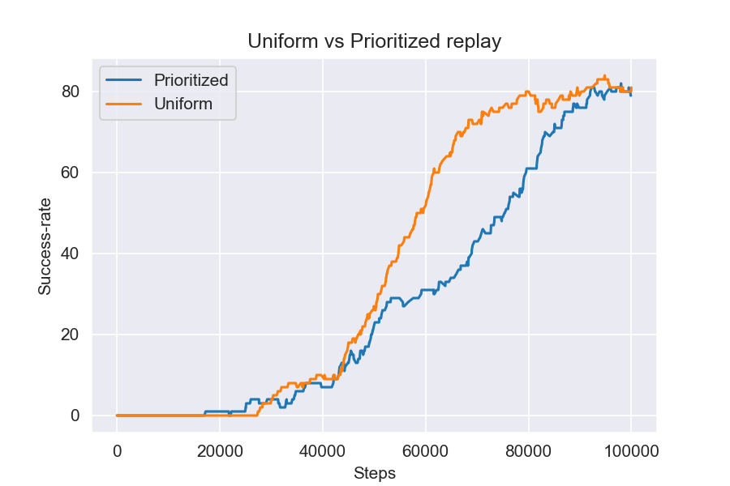
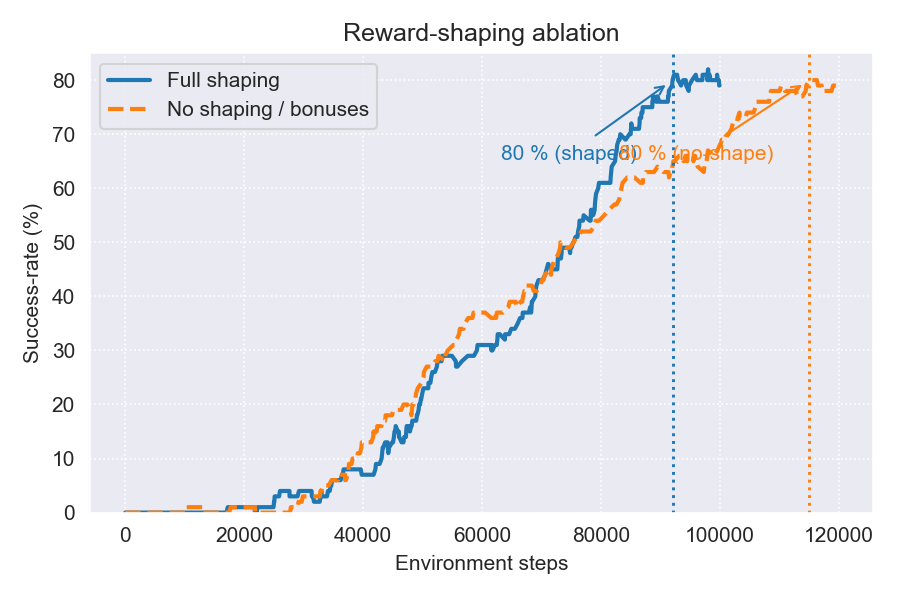
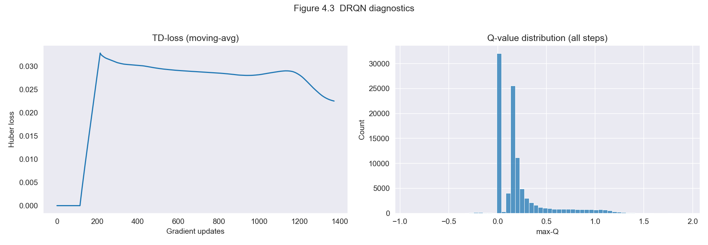

<div align="center">

# Navigating Dynamic Obstacles with Deep Recurrent Q-Networks

### Dueling DRQN with Prioritized Recurrent Replay for Partially Observable MiniGrid Environments

[](https://www.python.org/downloads/)
[](https://pytorch.org/)
[](https://gymnasium.farama.org/)
[](https://minigrid.farama.org/)
[](LICENSE)

**Igor Nazarenko & Yuval Amit** | Reichman University

[Report (PDF)](report/report.pdf) &bull; [Training Notebook](notebooks/training.ipynb) &bull; [Evaluation Notebook](notebooks/evaluation.ipynb) &bull; [Results](#key-results)

</div>

<br>

> **TL;DR** &mdash; We train a Dueling Deep Recurrent Q-Network (DRQN) to navigate a 16&times;16 MiniGrid maze with dynamic moving obstacles under partial observability (7&times;7 agent view). Using an R2D2-inspired prioritized recurrent replay buffer, reward shaping, and Double DQN, our agent achieves **98&ndash;100% success rate** across 100 evaluation episodes, while an A2C baseline fails to converge.

---

## Table of Contents

- [Key Results](#key-results)
- [Problem Setup](#problem-setup)
- [Architecture](#architecture)
- [Methods](#methods)
- [Ablation Studies](#ablation-studies)
- [Getting Started](#getting-started)
- [Repository Structure](#repository-structure)
- [Authors](#authors)

---

## Key Results

### Evaluation Summary (100 episodes, 16&times;16 Dynamic Obstacles)

| Agent | Success Rate | Avg Reward | Avg Steps | Collision | Timeout |
|:------|:-----------:|:----------:|:---------:|:---------:|:-------:|
| **Dueling DRQN (prioritized)** | **98.0%** &plusmn; 2.7% | +0.902 | **67.4** | 2.0% | 0.0% |
| Dueling DRQN (uniform) | **100.0%** &plusmn; 0.0% | +0.891 | 124.5 | 0.0% | 0.0% |
| A2C baseline | ~30&ndash;40% | &mdash; | &mdash; | &mdash; | &mdash; |

The prioritized replay variant is **1.8&times; more efficient** (67 vs 125 steps) while maintaining near-perfect success. The uniform variant trades efficiency for zero collisions.

### Training Progress

<p align="center">
  
</p>

<p align="center"><em>DRQN (top) steadily improves throughout training. A2C (bottom) collapses as environment complexity increases.</em></p>

---

## Problem Setup

**Environment:** MiniGrid-Dynamic-Obstacles-16&times;16-v0

The agent must navigate from a random start position to a goal in a 16&times;16 grid while avoiding randomly moving obstacles. This is formulated as a **Partially Observable Markov Decision Process (POMDP)**:

| Challenge | Detail |
|:----------|:-------|
| **Partial observability** | Agent sees only a 7&times;7 RGB window in its facing direction |
| **Dynamic obstacles** | Obstacles move randomly each step |
| **Stochastic layouts** | Map is randomly generated each episode |
| **Sparse rewards** | +1 for reaching goal, 0 for all other transitions |
| **Hard termination** | Episode ends on success, collision, or timeout |

The combination of partial observability, dynamic elements, and sparse rewards makes this significantly harder than static or fully observable MiniGrid variants.

---

## Architecture

### Dueling DRQN (Final Agent)

```
Input: RGB image (64x64x3), partially observable 7x7 agent view
  |
  +-- CNN Encoder
  |     Conv2d(3, 32, 8x8, stride 4) -> ReLU
  |     Conv2d(32, 64, 4x4, stride 2) -> ReLU
  |     Conv2d(64, 64, 3x3, stride 1) -> ReLU
  |     AdaptiveAvgPool2d -> Flatten
  |
  +-- GRU Backbone (hidden_size=512)
  |     Maintains temporal context across steps
  |     Handles partial observability through recurrence
  |
  +-- Dueling Heads
        Value Stream:     Linear(512 -> 1)    -> V(s)
        Advantage Stream: Linear(512 -> 3)    -> A(s,a)
        Q(s,a) = V(s) + (A(s,a) - mean(A))
```

**Why recurrence?** The agent only sees a 7&times;7 window. Without memory, it cannot track obstacle positions or maintain a map of explored areas. The GRU provides this temporal context.

**Why dueling?** Decomposing Q-values into state value and action advantage stabilizes learning when many states have similar values regardless of action.

### A2C Baseline (Comparison)

CNN encoder + 2-layer GRU (hidden=256) with actor-critic heads. Trained with curriculum learning across 5 progressive stages (5&times;5 empty &rarr; 5&times;5 obstacles &rarr; 8&times;8 empty &rarr; 8&times;8 obstacles &rarr; 16&times;16 obstacles). Despite extensive engineering, A2C failed to learn a stable policy on the full 16&times;16 task.

---

## Methods

### Prioritized Recurrent Replay Buffer

Inspired by [R2D2 (Kapturowski et al., 2019)](https://openreview.net/forum?id=r1lyTjAqYX), our replay buffer stores fixed-length sequences and samples them proportional to their maximum TD error:

- **Sequence length:** 16 steps with 12-step burn-in for hidden state warm-up
- **Prioritization:** &alpha; = 0.6, with importance sampling (&beta; annealed 0.4 &rarr; 1.0)
- **Double DQN:** Action selected by online network, evaluated by target network

### Reward Shaping

Sparse rewards make credit assignment difficult. We combine multiple shaping signals:

| Component | Effect |
|:----------|:-------|
| **Potential-based shaping** | Manhattan distance to goal (&phi; = -0.3 &times; d) |
| **Count-based exploration bonus** | &beta; / &radic;(N(s) + 1), cutoff at 50K steps |
| **Distance-scaled step penalty** | Encourages efficient paths, decays over training |
| **Collision penalty** | 1.5&times; multiplier on negative rewards |

### Training Stability

- **Polyak averaging** (&tau; = 0.005) for soft target network updates
- **Gradient clipping** (norm &le; 10) to prevent exploding gradients
- **Two-phase &epsilon;-greedy**: Fast decay 1.0 &rarr; 0.1, then slow decay 0.1 &rarr; 0.05
- **Warm start**: Pre-trained on 8&times;8 maps, then transferred to 16&times;16

---

## Ablation Studies

### Prioritized vs. Uniform Replay

<p align="center">
  
</p>

Both achieve high success rates, but they exhibit different trade-offs:
- **Prioritized**: Faster convergence, more sample-efficient (67 avg steps), 2% collision rate
- **Uniform**: Slower learning, but achieves 100% success with 0% collisions (124 avg steps)

### Reward Shaping Impact

<p align="center">
  
</p>

Reward shaping reaches 80% success ~30K steps earlier than the unshaped agent. Final shaped agent: 98% success in 67 steps (mean). Unshaped: 85% success in 586 steps (mean).

### DRQN Diagnostics

<p align="center">
  
</p>

<p align="center"><em>Left: TD loss converges and stabilizes. Right: Q-values are bounded and well-calibrated.</em></p>

---

## Getting Started

### Install Dependencies

```bash
git clone https://github.com/igornazarenko434/minigrid-dynamic-obstacles-rl.git
cd minigrid-dynamic-obstacles-rl
pip install -r requirements.txt
```

### Evaluate Pre-Trained Agent

Open `notebooks/evaluation.ipynb` and run all cells. The notebook loads the checkpoints from `checkpoints/` and evaluates both DRQN variants on 100 episodes with video recording.

### Train From Scratch

Open `notebooks/training.ipynb`. The notebook contains the full training pipeline for both A2C and Dueling DRQN agents with all hyperparameters configurable in-line.

<details>
<summary><strong>Full Hyperparameters (Dueling DRQN)</strong></summary>

| Parameter | Value |
|:----------|:------|
| Optimizer | Adam |
| Learning rate | 5e-5 |
| Batch size | 64 |
| Discount (&gamma;) | 0.95 |
| Replay buffer capacity | 100,000 |
| PER &alpha; | 0.6 |
| IS &beta; (annealed) | 0.4 &rarr; 1.0 over 200K steps |
| Sequence length | 16 steps |
| Burn-in length | 12 steps |
| Target update (&tau;) | 0.005 (Polyak) |
| Gradient clipping | norm &le; 10 |
| &epsilon; schedule | 1.0 &rarr; 0.1 (fast), 0.1 &rarr; 0.05 (slow) |
| Count bonus (&beta;) | 0.02 / &radic;(N+1), cutoff 50K |
| Total training steps | 100,000 |

</details>

---

## Repository Structure

```
minigrid-dynamic-obstacles-rl/
|
+-- notebooks/
|   +-- training.ipynb           # Full training pipeline (A2C + Dueling DRQN)
|   +-- evaluation.ipynb         # Evaluation with video recording
|
+-- checkpoints/
|   +-- drqn_prioritized.pth     # Best prioritized replay agent (98% success)
|   +-- drqn_uniform.pth         # Best uniform replay agent (100% success)
|
+-- figures/                     # Analysis plots from experiments
+-- videos/                      # Demo videos (success + collision)
+-- report/                      # Full research report (PDF)
+-- requirements.txt
+-- LICENSE
```

---

## Authors

**Igor Nazarenko** & **Yuval Amit**

M.Sc. Machine Learning & Data Science, Reichman University

---

## License

[MIT](LICENSE)
